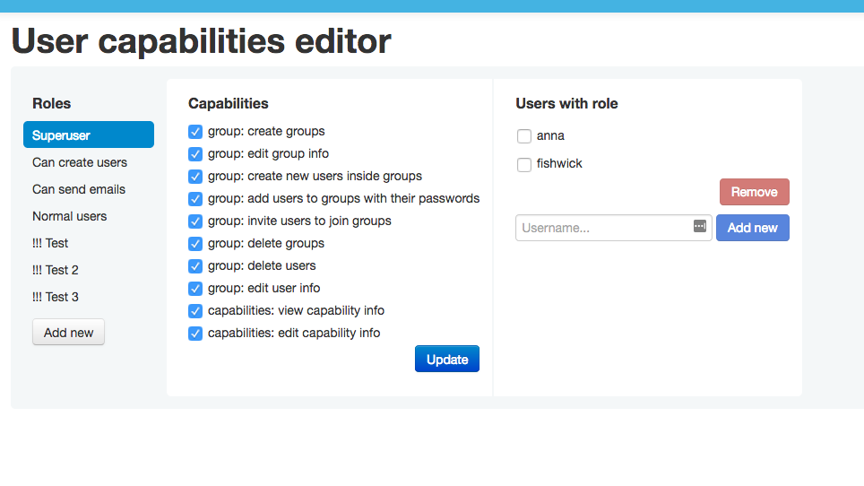

# User capabilities

This is an attempt to add some kind of fine-grained permissions model to EmonCMS, initially just the groups module.

## Concept

Roles are collections of capabilities granted to a particular set of users.  Each part of EmonCMS or its modules has a capability attached to it.

If the user is in a role that has a capability, they can do that thing.  If they aren't, they can't.  For example, this might be set up so that if a user has the `groups_can_view` capability, they can see the groups UI.  If they don't, they can't.

## Status

**Alpha**.  Getting closer to usable but not there yet.  Remaining bugs until first release [tracked here](https://github.com/takkaria/emoncms-user-capabilities/issues?q=is%3Aissue+is%3Aopen+label%3AMVP).  To be genuinely useful, it requires:

* patched `group` module (not public yet)
* patched core `route.php` to allow underscores:

```patch
diff --git a/route.php b/route.php
index 52b6445d..7db8f2af 100644
--- a/route.php
+++ b/route.php
@@ -98,8 +98,8 @@ class Route
         // trim slashes: '/user/view' => 'user/view'
         $q = trim($q, '/');
 
-        // filter out all except a-z and / .
-        $q = preg_replace('/[^.\/A-Za-z0-9-]/', '', $q);
+        // filter out all except alphanumerics and / . _ -
+        $q = preg_replace('/[^.\/_A-Za-z0-9-]/', '', $q);
 
         // Split by /
         $args = preg_split('/[\/]/', $q);
```

## Installation instructions

1. `git clone` into Modules directory
2. Add `const CAPABILITIES_ALWAYS_SUPERUSER = <userid>;` to `settings.php` for whoever your initial 'root' user will be
3. After installing, log in as that user and go to <emoncms url>/user_capabilities
4. You can use it.

## Screenshot



## Requirements

The capabilities frontend is written using "modern" JavaScript (ECMAScript 2015) so needs a modern browser (recent Firefox, Chrome, Edge, Safari will all be fine).

## Future plans

- Get this module working well enough with groups for now (involves thinking through security model of both this + groups + emon core together)
- Set up testing
- Compile down JavaScript into something more browser-friendly
- Figure out how to integrate with emoncms core – ideally replacing the current 'admin' flag on users somehow

